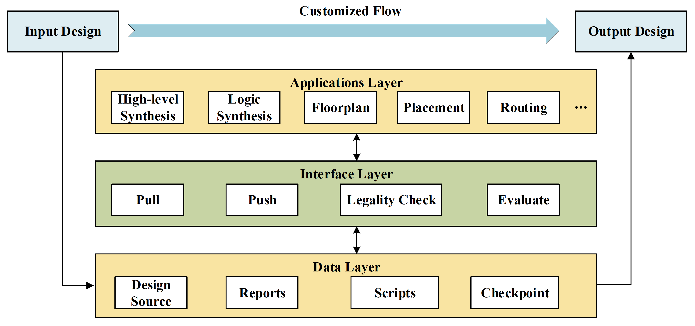

# Cocoon: An Infrastructure for Integrated EDA
Cocoon is an open source infrastructure for integrated EDA with interoperability and interactivity.
It contains a set of cross-tool interfaces and plays the role of EDA agent that can help IC designers 
choose EDA point tools to assemble a legal design flow and to produce ICs with higher quality of results (QoR).
It can also help EDA researchers and tool developer do research on new design methodology and cross-stage optimization.

## Cocoon Architecture

## Dependency
 - python3
 - [Yosys](https://github.com/YosysHQ/yosys)
 - [Hpyeropt](https://github.com/hyperopt/hyperopt)(optional for tuning)
 - genus (optional)
 - innovus (optional)
 
## Demo
 1. Branch Flow
 	python3 demo/branch/flow.py
 2. Flow Tuning
 	python3 demo/tuner/main.py
 
## Ongoing work
 - Integrating other open source binaries
 - Legality Check
 - More demo flows
